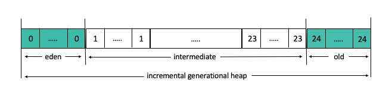

<!--
* Copyright (c) 2017, 2020 IBM Corp. and others
*
* This program and the accompanying materials are made
* available under the terms of the Eclipse Public License 2.0
* which accompanies this distribution and is available at
* https://www.eclipse.org/legal/epl-2.0/ or the Apache
* License, Version 2.0 which accompanies this distribution and
* is available at https://www.apache.org/licenses/LICENSE-2.0.
*
* This Source Code may also be made available under the
* following Secondary Licenses when the conditions for such
* availability set forth in the Eclipse Public License, v. 2.0
* are satisfied: GNU General Public License, version 2 with
* the GNU Classpath Exception [1] and GNU General Public
* License, version 2 with the OpenJDK Assembly Exception [2].
*
* [1] https://www.gnu.org/software/classpath/license.html
* [2] http://openjdk.java.net/legal/assembly-exception.html
*
* SPDX-License-Identifier: EPL-2.0 OR Apache-2.0 OR GPL-2.0 WITH
* Classpath-exception-2.0 OR LicenseRef-GPL-2.0 WITH Assembly-exception
-->

# Garbage collection

The process of managing memory in the VM is handled by the Allocator and the Garbage Collector (GC). These components operate on an area of memory that is reserved for VM processing called the Java heap.

The Allocator assigns areas of the Java heap for Java objects. See [Memory allocation](allocator.md) for more information about the Allocator.

## The garbage collector

To prevent applications running out of memory, objects in the Java heap that are no longer required must be reclaimed. This process is known as garbage collection. When garbage is collected, the garbage collector must obtain exclusive access to the heap, which causes an application to pause while the clean up is done. This pause is often referred to as a *stop-the-world* (STW) pause because an application must halt until the process completes. In general, the first step in the GC process is to mark the objects that are reachable, which means they are still in use. The next step is to sweep away the unmarked objects to reclaim memory. The final step is to compact the heap if the heap is badly fragmented.

## Garbage collection policies

OpenJ9 provides several GC policies that are designed around different application workloads and service level agreements. Each GC policy consists of a set of characteristics and features that aim to optimize one or more performance aspects of a running application. These performance aspects include application throughput, memory footprint, average pause times, worst-case pause times, and startup time.

Different policies require a Java heap that is configured in different ways in order to achieve different goals. The simplest configuration consists of a single area of memory, often referred to as a *flat* heap. Other configurations divide the heap into different areas or regions, which might contain objects of different ages (*generations*) or sizes.

A GC cycle is a repeatable process that involves a set of GC operations. These operations process all or parts of the Java heap to complete a discrete function. For example, a *mark* operation traces all objects in the heap to determine which ones are reachable. A *sweep* operation runs to clear away unreachable objects. Together, a *mark* and *sweep*  operation are capable of reclaiming used memory as part of a GC cycle.

A GC operation might complete in one step, or it might involve phases. For example, a *mark* operation consists of the following 3 phases:

- *Initial phase:* Identify all the root objects by running a root scan.
- *Main phase:* From the identified list, recursively trace references. Reachable objects are marked.
- *Final phase:* Process weakly reachable roots such as finalizable object lists, soft/weak references, monitor tables, and string tables.

GC policies use different GC cycles to manage different aspects of the heap. For example, the `gencon` policy runs a partial GC cycle on the *nursery* area of the heap to complete a *scavenge* operation. At other times, `gencon` also runs a global GC on the entire Java heap to complete *mark* and *sweep* (and optionally *compact*) operations.  

GC cycles might be divided into increments that run over a period of time to reduce maximum pause times. These increments might involve *stop-the-world* (STW) pauses that must halt application threads to give certain GC operations exclusive access to the Java heap. Alternatively, increments might include GC operations that can run concurrently with application processing.

The following table shows the heap configuration and the GC cycles and operations used by different policies:

| Policy         | Heap configuration |  GC cycles / operations |
|----------------|--------------------|-------------------------|
|`gencon`        | Two areas: *nursery* and *tenure*   Two generation groups: new/older |Global GC cycle: concurrent *mark-sweep* operations, optionally followed by a *compact* operation   Partial GC cycle: STW *scavenge* operation or concurrent *scavenge* operation (if `-Xgc:concurrentScavenge` is set) |
|`balanced`      | Multiple regions of equal size   Multiple generations: 24 |Global GC cycle: incremental concurrent *mark* operation (*global mark phase*), followed by a global STW *sweep* operation   Partial GC cycle: STW *copy forward* operation  or STW *mark-compact* operation |
|`optavgpause`   | Single area: *flat* | Global GC cycle: concurrent *mark-sweep* operations, optionally followed by a *compact* operation |
|`optthruput`    | Single area: *flat*  | Global GC cycle: STW *mark-sweep* operations, optionally followed by a *compact* operation|
|`metronome`     | Multiple regions   Segregated by size class | Global GC cycle: incremental STW *mark-sweep* operation in small interruptible steps |
|` nogc`         | Single area: *flat* | No GC cycles |

<i class="fa fa-pencil-square-o" aria-hidden="true"></i> **Note:** All OpenJ9 GC policies support compressed references on 64-bit platforms, which compresses heap pointers to 32 bits if the total heap size does not exceed the theoretical upper bound of 64 GB. Applications that require more heap space can select any heap size within the bounds imposed by the operating system and available system RAM, without using compressed references. For more information, see [compressed references](allocation.md#compressed-references).

### Policy selection and tuning

The default GC policy is `gencon`, which suits a broad spectrum of applications. Choosing a different GC policy should be guided by the application dynamics and an observation of how the application interacts with the heap during startup and at steady state. To help with this analysis, all OpenJ9 GC policies are instrumented to collect a wide range of GC-related metric data for reporting in a GC log file.

To enable GC logging for the OpenJ9 Java runtime, include the `-verbose:gc` option on the command line. By default, this option prints output to `stderr` but you can send the output to a log file by using [`-Xverbosegclog`](xverbsoegclog). You can then visualize the output by loading the GC log into the [Garbage Collector and Memory Visualizer (GCMV) plugin for Eclipse](https://marketplace.eclipse.org/content/ibm-monitoring-and-diagnostic-tools-garbage-collection-and-memory-visualizer-gcmv). OpenJ9 Java GC logs can also be analyzed by some online services, such as [GCEasy](https://gceasy.io/).

To select a different GC policy, specify the [`-Xgcpolicy`](xgcpolicy.md) option on the command line. To adjust the initial and maximum size of the Java heap, use the [`-Xms` and `-Xmx`](xms.md) command line options. For generational GC policies, you can also set the [`-Xmn`, `-Xmns`, and `-Xmnx`](xmn.md) options.

### `gencon` policy (default)

The Generational Concurrent GC policy ([`-Xgcpolicy:gencon`](xgcpolicy.md#gencon)) is probably best suited if you have a transactional application, with many short lived objects. This policy aims to minimize GC pause times without compromising throughput. This is the default policy employed by the VM, so if you want to use it you don't need to specify it on the command line when you start your application.

If your application requires the allocation of objects of very different sizes and liveness on the Java heap, you might experience heap fragmentation, which in turn might lead to global heap compaction. In these circumstances, the [Balanced GC policy](xgcpolicy.md#balanced-policy) might be more appropriate.

#### GC operations

With the `gencon` policy, the Java heap is divided into two main areas, the *nursery* area, where new objects are created and the *tenure* area, where objects are moved if they have reached *tenure age*.

The *nursery* area is subdivided into two further areas, the *allocate* space and the *survivor* space. The GC process is illustrated in the following diagram, which shows a sequence of 4 main events:

1. Objects are created in the *allocate* space.
2. The *allocate* space is full.
3. A local GC scavenge process runs and reachable objects are either copied into the *survivor* space or into the *tenure* area if they have reached *tenure age*. Any objects that can't be reached are left untouched and subsequently cleared.
4. The *allocate* and *survivor* spaces swap roles. The original *survivor* space becomes the *allocate* space where new objects are created, and the original *allocate* space becomes the *survivor* space ready for the next local GC scavenge process.

The relative sizes of the *allocate* and *survivor* spaces are dynamically adjusted by a technique called *tilting*. When the *nursery* area is first created, it is evenly divided between the *allocate* and *survivor* spaces. If, after a GC scavenge process is run, the amount of space required for the *survivor* area is comparatively small, the boundary between the two spaces is adjusted by *tilting*. For example, if the *survivor* space requires only 10% of the *nursery* area, the *tilt ratio* is adjusted to give 90% of the *nursery* area to the *allocate* space. With more space available for new objects, garbage collection can be delayed.

The *tenure age* of an object is determined by the VM and reflects the number of times that an object has been copied between the *allocate* space and the *survivor* space. The age is in the range 1 - 14 and is adjusted dynamically by the VM depending on the overall amount of space that is used in the *nursery area*. For example, if an object has a tenure age of 5, it has been copied backwards and forwards between *allocate* and *survivor* spaces 5 times. If the VM sets a *tenure age* of 5 based on the percentage of space remaining in the *nursery* area, the next scavenge moves the object from the *nursery* to the *tenure* area. You can set an initial *tenure age* with the [`-Xgc:scvTenureAge`](xgc.md#scvtenureage) option. You can also prevent the VM dynamically adjusting the *tenure age* by setting the [`Xgc:scvNoAdaptiveTenure`](xgc.md#scvnoadaptivetenure) option so that the intial age is maintained throughout the run time of the VM.

Within the *tenure* area, new objects are allocated into the small object area (SOA), which is illustrated in the earlier diagram (see 3.). A large object area (LOA) is set aside for objects greater than 64 KB that cannot be allocated into the SOA to minimize fragmentation. The LOA is allocated by default but is reduced and removed after a few GC cycles if it isn't populated. To prevent the creation of an LOA, you can specify the [`-Xnoloa`](xloa.md) option on the command line when you start your application. When the *tenure* area is close to full a global GC is triggered.

The local GC scavenge reduces pause times by freqently reclaiming memory in the *nursery* area which, for a transactional application with many short-lived objects, has the most recyclable space. However, over time the *tenure* area might become full. So, whilst a local GC scavenge process is operating on the *nursery* area, a concurrent global GC process also runs alongside normal program execution to mark and remove unreachable objects from the *tenure* area. These two GC approaches combine to provide a good trade-off between shorter pause times and consistent throughput.

#### Concurrent Scavenge

A special mode of the `gencon` policy is known as *Concurrent Scavenge*. This mode aims to further reduce the average time spent in stop-the-world pauses by collecting nursery garbage in parallel with running application threads. Whilst aiming to reduce the average time, this mode does not improve the worst case pause time when compared to running `gencon` without Concurrent Scavenge enabled.

To enable Concurrent Scavenge, see [-Xgc:concurrentScavenge](xgc.md#concurrentscavenge).

This mode can be enabled with hardware-based support and software-based support:

- **Hardware-based support: (Linux on IBM Z&reg; and z/OS&reg;)** This mode works on the IBM z14™ and later mainframe system with the Guarded Storage (GS) Facility. The GS Facility provides hardware-based support to detect when potentially stale references to objects are accessed by an application. This means that the garbage collector can start processing objects in parts of the heap without halting an application because the GS Facility is on hand to spot accesses to an object and send a notification. The object that was ready to be swept away can be moved, and references to it can be reset.

- **Software-based support: (64-bit: Linux on (x86-64, POWER, IBM Z&reg;), AIX&reg;, macOS&reg;, and z/OS&reg;)** With software-based support, Concurrent Scavenge can be enabled without any pre-requisite hardware although the performance throughput is not as good as hardware-based support.

More information about Concurrent Scavenge mode can be found in the blog post [Concurrent Scavenge Garbage Collection Policy](https://blog.openj9.org/2019/03/25/concurrent-scavenge-garbage-collection-policy/).

### `balanced` policy

The Balanced GC policy ([`-Xgcpolicy:balanced`](xgcpolicy.md#balanced)) evens out pause times and reduces the overhead of some of the costlier operations that are typically associated with garbage collection, such as compaction and class unloading. The Java heap is divided into a large number of regions (1,000 - 2,000), which are managed individually by an incremental generational collector to reduce the maximum pause time on large heaps and increase the efficiency of garbage collection. The aim of the policy is to avoid global garbage collections by matching object allocation and survival rates.

####  When to use

The Balanced policy suits applications that require large heaps (>64 Mb) on 64-bit platforms. This policy might be a good alternative for applications that experience unacceptable pause times with `gencon`.

- If you have problems with application pause times that are caused by global garbage collections, particularly compactions, this policy might improve application performance.

- If you are using large systems that have Non-Uniform Memory Architecture (NUMA) characteristics (x86 and POWER&trade; platforms only), the Balanced policy might further improve application throughput.

However, even though pause times are typically evened out across GC operations, actual pause times are affected by object allocation rates, object survival rates, and fragmentation levels within the heap, and cannot therefore be bound to a certain maximum nor can a certain utilization level be guaranteed.

#### GC operations

During VM startup, the GC divides the heap memory into regions of equal size. These regions remain static for the lifetime of the VM and are the basic unit of garbage collection and allocation operations. For example, when the heap is expanded or contracted, the memory committed or released corresponds to a certain number of regions. Although the Java heap is a contiguous range of memory addresses, any region within that range can be committed or released as required. This enables the Balanced GC to contract the heap more dynamically and aggressively than other garbage collectors, which typically require the committed portion of the heap to be contiguous.

Regions impose a maximum object size. Objects are always allocated within the bounds of a single region and are never permitted to span regions. The region size is always a power of two; for example, 512 KB, 1 MB, and so on (where KB is 210 bytes and MB is 220 bytes). The region size is selected at startup based on the maximum heap size. The collector chooses the smallest power of two which will result in less than 2048 regions, with a minimum region size of 512 KB. Except for small heaps (less than about 512 MB) the VM aims to have between 1024 and 2047 regions.

Object ages are tracked for each region with a maximum of 24 possible generations. The following diagram illustrates the structure of the object heap:

 The *eden* space is a set of regions of age 0, which contain the newest objects allocated. Regions of intermediate age serve as survivor regions to receive live objects moved from younger regions. When the eden space is full, a partial garbage collection (PGC) runs to reclaim space, typically by using a *copy forward* operation. In specific cases, a *mark-compact* operation might be used, for example, when there are not enough free survivor regions available. The PGC is a stop-the-world operation, after which new regions are allocated to create a new eden space. A PGC always includes the eden space, but might include older regions. Objects within collectible regions of intermediate age N are evacuated to survivor regions of age N+1. Regions of age 24 are included in PGC collection sets in order to defragment them.

Over time, transient objects drop out of the live set and viable survivor regions become scarce. This problem is solved by introducing a global mark phase (GMP) to mark and sweep the entire heap. GMP is a hybrid *incremental-concurrent* GC cycle. Each GMP increment is interleaved with a PGC cycle so that regions that are left sparse after sweeping the heap can be collected, cleared, and recycled during and after the GMP.

With the `balanced` policy, a global GC cycle is rare, occurring only in very tight memory conditions when PGC and GMP operations cannot free enough memory on the heap. These global GCs are explicit GCs, like those invoked by an application calling `System.gc()`.

#### Arraylets: dealing with large arrays

Most objects are easily contained within the minimum region size of 512 KB. However, some large arrays might require more memory than is available in a single region. To support such arrays, the Balanced GC uses an **arraylet** representation to more effectively store large arrays in the heap. (Arraylets are also used by the Metronome GC; both Balanced and Metronome GC policies are region-based garbage collectors.)

Arraylets have a **spine**, which contains the class pointer and size, and **leaves**, which contain the data associated with the array. The spine also contains **arrayoids** which are pointers to the respective arraylet leaves, as shown in the following diagram.

There are a number of advantages to using arraylets.

- Because the heap tends to fragment over time, other collector policies might be forced to run a global garbage collection and defragmentation (compaction) phase to recover sufficient contiguous memory to allocate a large array. By removing the requirement for large arrays to be allocated in contiguous memory, the Balanced GC is more likely to be able to satisfy such an allocation without requiring unscheduled garbage collection, particularly a global defragmentation operation.

- Additionally, the Balanced GC never needs to move an arraylet leaf once it has been allocated. The cost of relocating an array is therefore limited to the cost of relocating the spine, so large arrays do not contribute to higher defragmentation times.

<i class="fa fa-pencil-square-o" aria-hidden="true"></i> **Note:** Despite the general advantage of using arraylets, they can slow down processing when the Java Native Interface (JNI) is being used. The JNI provides flexibility by enabling Java programs to call native code; for example C or C++, and if direct addressability to the inside of an object is needed, a JNI critical section can be used. However, that requires the object to be in a contiguous region of memory, or at least _appear_ to be so. The JNI therefore creates a temporary contiguous array that is the same size as the original array and copies everything, element by element, to the temporary array. After the JNI critical section is finished, everything is copied from the temporary array back to the arraylet, element by element.

### `optavgpause` policy

[`-Xgcpolicy:optavgpause`](xgcpolicy.md#optavgpause) uses the global collector to manage a flat heap comprised of a single region and to compact the heap if the heap becomes fragmented. The global collector is started preemptively so that the cycle finishes before the heap is completely exhausted. By anticipating global collections and initiating some marking before the stop-the-world global collection phase, the `optavgpause` policy reduces the likelihood of long interruptions of service due to GC activity and pause times are reduced when compared to `optthruput` though at the expense of some performance throughput.

#### When to use

You are likely to find that in many situations, the default [`gencon` policy](#gencon-policy-default) offers better performance than `optavgpause`. However, the `optavgpause` policy lacks a generational write barrier (though it does have a write barrier to support concurrent mark, and might therefore be of benefit with benefit workloads that have a costly generational barrier; for example, in situations that frequently change large and old reference arrays.

An additional potential problem with generation GCs is that they split the heap so that a very large object in a worst case might not fit in either of the 2 areas, while there is enough total free memory, or in better case, allocation may succeed but require additional GC cycles and copying of objects (relative to non-generational GC) to accommodate large enough contiguous free space.

Overall, `optavgpause`, along with `optthruput`, is best suited to short-lived applications and to long-running services involving concurrent sessions that have short lifespans. Short-lived applications with adequate heap sizes usually complete without compaction, and the flat heap fragments more slowly when session-bound objects are allocated and drop out of the live set in short overlapping clusters.

### `optthruput` policy

[`-Xgcpolicy:optthruput`](xgcpolicy.md#optthruput) uses the global collector to manage a flat heap comprised of a single region and to compact the heap if the heap becomes fragmented. The global collector runs to mark and sweep the heap when the heap is exhausted, which means that applications stop for long pauses while garbage collection takes place.

#### When to use

You might consider using this policy when your application can tolerate longer GC pauses to obtain better overall throughput. However, you are likely to find that in many situations, the default [`gencon` policy](#gencon-policy-default) offers better performance than `optthruput`. Nevertheless, the `optthruput` policy is free of any object access barriers (unlike `gencon` that has a write barrier to support concurrent mark, and a generational write barrier) and in some workloads, the cost of those barriers might be high enough to make this policy preferable.

An additional potential problem with generation GCs is that they split the heap so that a very large object in a worst case might not fit in either of the 2 areas, while there is enough total free memory, or in better case, allocation may succeed but require additional GC cycles and copying of objects (relative to non-generational GC) to accommodate large enough contiguous free space.

Overall, `optthruput`, along with `optavgpause`, is best suited to short-lived applications and to long-running services involving concurrent sessions that have short lifespans. Short-lived applications with adequate heap sizes usually complete without compaction, and the flat heap fragments more slowly when session-bound objects are allocated and drop out of the live set in short overlapping clusters.

### `metronome` policy

**(Linux on x86-64 and AIX platforms only)**

[`-Xgcpolicy:metronome`](xgcpolicy.md#metronome-aix-linux-x86-only) is designed for applications that require a precise upper bound on collection pause times as well as specified application utilization: the proportion of time that the application is permitted to use, with the remainder being devoted to GC. The realtime GC runs in short interruptible bursts to avoid long stop-the-world pauses.

The realtime heap is allocated as a contiguous range of RAM partitioned into small regions of equal size, usually about 64 KB. There is no dynamic heap resizing when you use the `metronome` policy. The heap is always fully expanded even if [`-Xms`](xms.md) is not set to [`-Xmx`](xms.md).

As with the `balanced` GC policy, arrays are represented as arraylets with a spine pointing to a series of regions containing the array elements (see [Arraylets: dealing with large arrays](#arraylets-dealing-with-large-arrays) for more information). Note that JNI access to array data might involve reconstituting arraylets as contiguous arrays, which can significantly slow down processing.

Each region of the heap is either empty, or contains only objects in one of 16 size classes, or an arraylet. This organization improves the use of available heap space, reducing the need for heap compaction and defragmentation, and providing more precise control over the *incremental sweep* operation.

Although high application utilization is desirable for optimal throughput, the GC must be able to keep up with the application's memory  allocation rate. 

A higher utilization typically requires a larger heap because the GC isn't allowed to run as much as a lower utilization would permit. The relationship between utilization and heap size is highly application dependent, and striking an appropriate balance requires iterative experimentation with the application and VM parameters. You might need to adjust heap size or pause time or target utilization to achieve an acceptable runtime configuration.

See [`-Xgcpolicy:metronome`](xgcpolicy.md#metronome-aix-linux-x86-only) for details of the configuration parameters you can set.

### `nogc` policy

[`-Xgcpolicy:nogc`](xgcpolicy.md#nogc) handles only memory allocation and heap expansion, but doesn't reclaim any memory. The GC impact on runtime performance is therefore minimized, but if the available Java heap becomes exhausted, an `OutOfMemoryError` exception is triggered and the VM stops.

#### When to use

This policy is not suited to the majority of Java applications. However, the following use cases apply:

- Testing during development

    - GC performance: Use `nogc` as a baseline when testing the performance of other GC policies, including the provision of a low-latency baseline.

    - Application memory: Use `nogc` to test your settings for allocated memory. If you use `-Xmx` to set the heap size that should not be exceeded, your application terminates with a heap dump if it tries to exceed your memory limit.

- Running applications with minimal or no GC requirements

    - You might use `nogc` when an application is so short-lived that allocated memory is never exhausted and running a full GC cycle is therefore a waste of resources.

    - Similarly, when memory application is well understood or where there is rarely memory to be reclaimed, you might prefer to avoid unnecessary GC cycles and rely on a failover mechanism to occasionally restart the VM.

## Troubleshooting

You can diagnose problems with garbage collection operations by turning on verbose garbage collection logging. By default, the information is printed to STDERR but can be redirected to a file by specifying the `-Xverbosegclog` option. The log files contain detailed information about all operations, including initialization, stop-the-world processing, finalization, reference processing, and allocation failures. For more information, see [Verbose garbage collection](https://www.ibm.com/support/knowledgecenter/SSYKE2_8.0.0/com.ibm.java.vm.80.doc/docs/mm_gc_pd_verbosegc.html)

If verbose logs do not provide enough information to help you diagnose GC problems, you can use GC trace to analyze operations at a more granular level. For more information, see [-Xtgc](xtgc.md).

<!-- ==== END OF TOPIC ==== gc.md ==== -->
