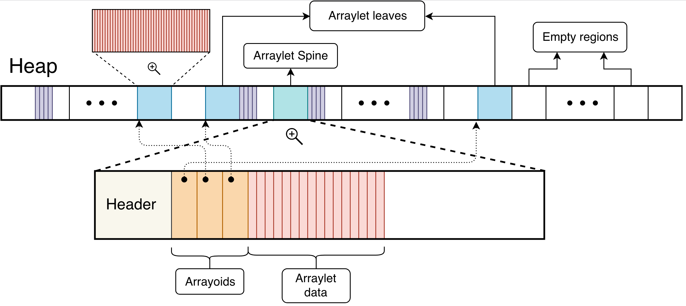

<!--
* Copyright (c) 2017, 2020 IBM Corp. and others
*
* This program and the accompanying materials are made
* available under the terms of the Eclipse Public License 2.0
* which accompanies this distribution and is available at
* https://www.eclipse.org/legal/epl-2.0/ or the Apache
* License, Version 2.0 which accompanies this distribution and
* is available at https://www.apache.org/licenses/LICENSE-2.0.
*
* This Source Code may also be made available under the
* following Secondary Licenses when the conditions for such
* availability set forth in the Eclipse Public License, v. 2.0
* are satisfied: GNU General Public License, version 2 with
* the GNU Classpath Exception [1] and GNU General Public
* License, version 2 with the OpenJDK Assembly Exception [2].
*
* [1] https://www.gnu.org/software/classpath/license.html
* [2] http://openjdk.java.net/legal/assembly-exception.html
*
* SPDX-License-Identifier: EPL-2.0 OR Apache-2.0 OR GPL-2.0 WITH
* Classpath-exception-2.0 OR LicenseRef-GPL-2.0 WITH Assembly-exception
-->

# The `balanced` policy

## From `gc.md`.

The Balanced GC policy ([`-Xgcpolicy:balanced`](xgcpolicy.md#balanced)) evens out pause times and reduces the overhead of some of the costlier operations typically associated with garbage collection. It divides the Java heap into regions, which are managed individually to reduce the maximum pause time on large heaps and increase the efficiency of garbage collection. The aim of the policy is to avoid global garbage collections by matching object allocation and survival rates. 

If you have problems with application pause times that are caused by global garbage collections, particularly compactions, this policy might improve application performance. If you are using large systems that have Non-Uniform Memory Architecture (NUMA) characteristics (x86 and POWER&trade; platforms only), the Balanced policy might further improve application throughput. However, even though pause times are typically evened out across GC operations, actual pause times are affected by object allocation rates, object survival rates, and fragmentation levels within the heap, and cannot therefore be bound to a certain maximum nor can a certain utilization level be guaranteed. 

During VM startup, the GC divides the heap memory into regions of equal size. These regions remain static for the lifetime of the VM and are the basic unit of garbage collection and allocation operations. For example, when the heap is expanded or contracted, the memory committed or released corresponds to a certain number of regions. Although the Java heap is a contiguous range of memory addresses, any region within that range can be committed or released as required. This enables the Balanced GC to contract the heap more dynamically and aggressively than other garbage collectors, which typically require the committed portion of the heap to be contiguous.

Regions impose a maximum object size. Objects are always allocated within the bounds of a single region and are never permitted to span regions. The region size is always a power of two; for example, 512 KB, 1 MB, and so on (where KB is 210 bytes and MB is 220 bytes). The region size is selected at startup based on the maximum heap size. The collector chooses the smallest power of two which will result in less than 2048 regions, with a minimum region size of 512 KB. Except for small heaps (less than about 512 MB) the VM aims to have between 1024 and 2047 regions. 

#### Arraylets: dealing with large arrays

Most objects are easily contained within the minimum region size of 512 KB. However, some large arrays might require more memory than is available in a single region. To support such arrays, the Balanced GC uses an **arraylet** representation to more effectively store large arrays in the heap. (Arraylets are also used by the Metronome GC; both Balanced and Metronome GC policies are region-based garbage collectors.)

Arraylets have a **spine**, which contains the class pointer and size, and **leaves**, which contain the data associated with the array. The spine also contains **arrayoids** which are pointers to the respective arraylet leaves, as shown in the following diagram.

There are a number of advantages to using arraylets. 

- Because the heap tends to fragment over time, other collector policies might be forced to run a global garbage collection and defragmentation (compaction) phase to recover sufficient contiguous memory to allocate a large array. By removing the requirement for large arrays to be allocated in contiguous memory, the Balanced GC is more likely to be able to satisfy such an allocation without requiring unscheduled garbage collection, particularly a global defragmentation operation. 
- Additionally, the Balanced GC never needs to move an arraylet leaf once it has been allocated. The cost of relocating an array is therefore limited to the cost of relocating the spine, so large arrays do not contribute to higher defragmentation times.

<i class="fa fa-pencil-square-o" aria-hidden="true"></i> **Note:** Despite the general advantage of using arraylets, they can slow down processing when the Java Native Interface (JNI) is being used: JNI provides flexibility by enabling Java programs to call native code; for example C or C++. If direct addressability to the inside of an object is needed, a JNI critical section can be used. But that requires the object to be in a contiguous region of memory, or at least _appear_ to be so. The JNI therefore creates a temporary contiguous array that is the same size as the original array and copies everything, element by element, to the temporary array. After the JNI critical section is finished, everything is copied from the temporary array back to the arraylet, element by element.

## From `xgcpolicy.md`

: The balanced policy uses mark, sweep, compact and generational style garbage collection. The concurrent mark phase is disabled; concurrent garbage collection technology is used, but not in the way that concurrent mark is implemented for other policies. The `balanced` policy uses a region-based layout for the Java&trade; heap. These regions are individually managed to reduce the maximum pause time on large heaps and increase the efficiency of garbage collection. The policy tries to avoid global collections by matching object allocation and survival rates.

: If you have problems with application pause times that are caused by global garbage collections, particularly compactions, this policy might improve application performance. If you are using large systems that have Non-Uniform Memory Architecture (NUMA) characteristics (x86 and POWER&trade; platforms only), the balanced policy might further improve application throughput.

    <i class="fa fa-pencil-square-o" aria-hidden="true"></i> **Note:** If you are using the balanced GC policy in a Docker container that uses the default `seccomp` Docker profile, you must start the container with `--security-opt seccomp=unconfined` to exploit NUMA characteristics. These options are not required if you are running in Kubernetes, because `unconfined` is set by default (see [Seccomp]( https://kubernetes.io/docs/concepts/policy/pod-security-policy/#seccomp)).

    For more information about this policy, including when to use it, see [Balanced Garbage Collection policy](https://www.ibm.com/support/knowledgecenter/SSYKE2_8.0.0/com.ibm.java.vm.80.doc/docs/mm_gc_balanced.html).

## From Briggs

The balanced policy accommodates applications that require large heaps (>64 Mb) on 64-bit platforms. This policy may be a good alternative for applications that experience unacceptable pause times with gencon. Also, the incremental generational collector can leverage Non-Uniform Memory Architecture (NUMA) capabilities on supporting platforms to optimize collection throughput.

An incremental generational collector is used to manage a heap that is split into a large number, typically 1 or 2 thousand, of regions. Each region is assigned an age ranging from 0 (youngest) to 24 (oldest). New objects are allocated from a subset of regions of age 0 or 1 comprising eden space. The default size of eden space in the incremental generational heap is 25% of the entire heap. This can be adjusted using the Xmn (fixed eden size) or Xmns and Xmnx (variable eden size) options. Regions of intermediate age serve as survivor regions to receive live objects copied forwarded from younger regions. Regions of maximal age (24) are collectively analogous to tenure space within the generational heap.

A conceptual view of the incremental generational heap is shown in the figure below.

[Conceptual view of incremental generational heap]

The incremental generational collector proceeds in three main phases or cycles. Generational copying occurs in incremental partial global cycles (PGCs) when a subset of regions is selected for clearing. This always includes eden regions but older regions of age <24 may also be included if they are in an age group that has a historically high mortality rate. Objects within collectible regions of intermediate age N are evacuated to survivor regions of age N+1. Regions of age 24 are never included in PGC collection sets but may be included for compaction in global GC (GGC) cycles, which mark and sweep the whole heap and compact regions that need defragmentation.

Over time, transient objects drop out of the live set and viable survivor regions become scarce. At some point a global mark phase (GMP) will commence to mark and sweep the entire heap. Each increment of the GMP is followed by an increment of PGC, so regions that are left sparse after sweeping can be collected, cleared, and recycled during and after GMP.

The balanced GC policy uses a special representation for arrays that should be considered when selecting a GC policy. Arrays that can be contained within a single region are represented contiguously in the heap, as with gencon. Larger arrays have discontiguous representation in the heap, consisting of a spine that contains the object header and an array of 0 or more pointers to arraylets, where each arraylet occupies an entire region. With gencon, large arrays always have contiguous representation and must be flipped through the nursery, which is to say they will be copied up to 14 times if they reach tenure age. With the balanced GC policy, only the array spine and remainder array elements contiguous with the spine need to be copied in PGC cycles.

As with gencon, objects that are pinned for JNI access prevent the containing regions from being included in PGC collection sets. Additionally, and importantly for applications that export large arrays through JNI, the discontiguous representation of large arrays requires that the entire array must be reconstituted contiguously for JNI access and this may place a crippling load on the system if this type of access is frequently used.

<!-- ==== END OF TOPIC ==== gc_balanced.md ==== -->
