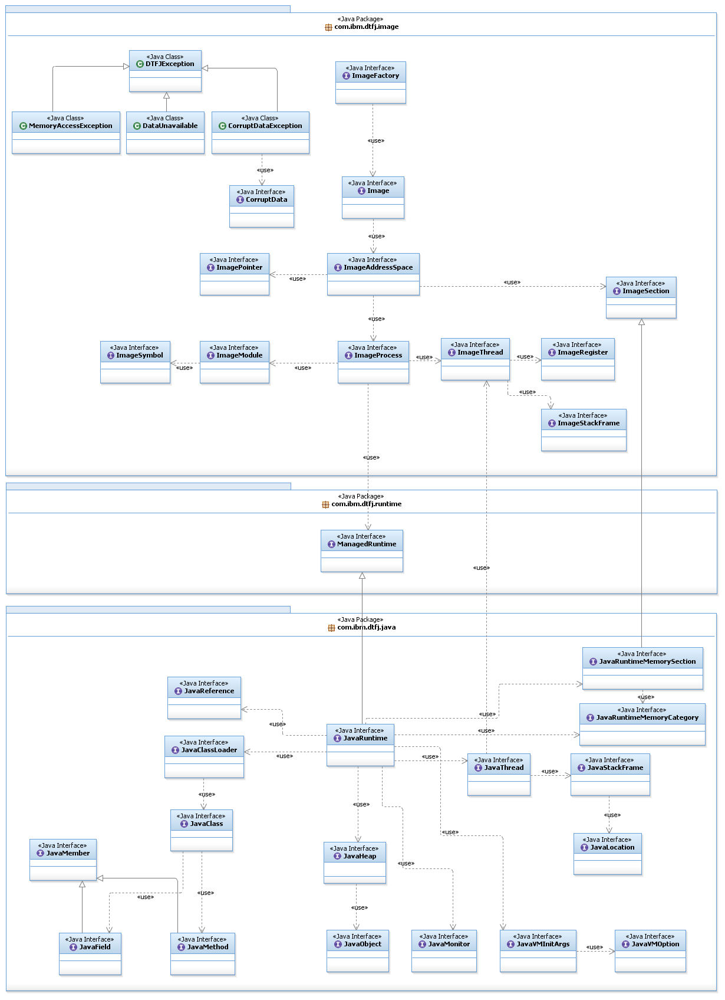

<!--
* Copyright (c) 2017, 2025 IBM Corp. and others
*
* This program and the accompanying materials are made
* available under the terms of the Eclipse Public License 2.0
* which accompanies this distribution and is available at
* https://www.eclipse.org/legal/epl-2.0/ or the Apache
* License, Version 2.0 which accompanies this distribution and
* is available at https://www.apache.org/licenses/LICENSE-2.0.
*
* This Source Code may also be made available under the
* following Secondary Licenses when the conditions for such
* availability set forth in the Eclipse Public License, v. 2.0
* are satisfied: GNU General Public License, version 2 with
* the GNU Classpath Exception [1] and GNU General Public
* License, version 2 with the OpenJDK Assembly Exception [2].
*
* [1] https://www.gnu.org/software/classpath/license.html
* [2] https://openjdk.org/legal/assembly-exception.html
*
* SPDX-License-Identifier: EPL-2.0 OR Apache-2.0 OR GPL-2.0-only WITH Classpath-exception-2.0 OR GPL-2.0-only WITH OpenJDK-assembly-exception-1.0
-->

# Diagnostic Tool Framework for Java

The Diagnostic Tool Framework for Java&trade; (DTFJ) is a Java application programming interface (API) that is used to support the building of Java diagnostic tools. DTFJ works with data from a system dump or a Java dump.

On Linux and AIX® operating systems, you can get more information from a system dump if you also have copies of executable files and libraries. You can run the `jpackcore` utility to collect these files into a single archive for use in subsequent problem diagnosis. For more information, see [Dump extractor](tool_jextract.md).

The DTFJ API helps diagnostic tools access the following information:  

- Memory locations stored in the dump (System dumps only)
- Relationships between memory locations and Java internals (System dumps only)
- Java threads running in the VM
- Native threads held in the dump (System dumps only)
- Java classes and their class loaders that were present
- Java objects that were present in the heap (System dumps only)
- Java monitors and the objects and threads they are associated with
- Details of the workstation on which the dump was produced (System dumps only)
- Details of the Java version that was being used
- The command line that launched the VM

If your DTFJ application requests information that is not available in the Java dump, the API will return null or throw a `DataUnavailable` exception. You might need to adapt DTFJ applications written to process system dumps to make them work with Java dumps.

DTFJ is implemented in pure Java and tools written using DTFJ can be cross-platform. Therefore, you can analyze a dump taken from one workstation on another (remote and more convenient) machine. For example, a dump produced on an AIX® Power® system can be analyzed on a Windows laptop.

See the [DTFJ API documentation](api-dtfj.md). <!-- Link to API -->

:fontawesome-solid-pencil:{: .note aria-hidden="true"} **Note:** If the code that loads DTFJ is in a module, the module must require the `openj9.dtfj` module. For example:

```
module MyModule {
  requires openj9.dtfj;
}
```

## Using the DTFJ interface

To create applications that use DTFJ, you must use the DTFJ interface. Implementations of this interface have been written that work with system dumps and Java dumps.

The diagram that follows illustrates the DTFJ interface. The starting point for working with a dump is to obtain an `Image` instance by using the `ImageFactory` class supplied with the concrete implementation of the API.

### Working with a system dump

The following example shows how to work with a system dump. In this example, the only section of code that ties the dump to a particular implementation of DTFJ is the generation of the factory class. Change the factory if you want to use a different implementation.

If there is a problem with the file that is passed to the `getImage()` method, an `IOException` is thrown and an appropriate message is issued. If a missing file is passed to the example shown, the following output is produced:

````
Could not find/use required file(s)
java.io.FileNotFoundException: core_file.xml (The system cannot find the file specified.)
        at java.io.FileInputStream.open(Native Method)
        at java.io.FileInputStream.<init>(FileInputStream.java:135)
        at com.ibm.dtfj.image.j9.ImageFactory.getImage(ImageFactory.java:47)
        at com.ibm.dtfj.image.j9.ImageFactory.getImage(ImageFactory.java:35)
        at DTFJEX1.main(DTFJEX1.java:23)Copy
````

In this case, the DTFJ implementation is expecting a dump file to exist. Different errors are caught if the file existed but was not recognized as a valid dump file.

<details>
  <summary>Example of working with a system dump</summary>

````
import java.io.File;
import java.util.Iterator;
import java.io.IOException;

import com.ibm.dtfj.image.CorruptData;
import com.ibm.dtfj.image.Image;
import com.ibm.dtfj.image.ImageFactory;

public class DTFJEX1 {
    public static void main(String[] args) {
        Image image = null;
        if (args.length > 0) {
            File f = new File(args[0]);
            try {
                Class<?> factoryClass = Class.forName("com.ibm.dtfj.image.j9.ImageFactory");
                ImageFactory factory = (ImageFactory) factoryClass.getDeclaredConstructor().newInstance();
                image = factory.getImage(f);
            } catch (ClassNotFoundException e) {
                System.err.println("Could not find DTFJ factory class");
                e.printStackTrace(System.err);
            } catch (IllegalAccessException e) {
                System.err.println("IllegalAccessException for DTFJ factory class");
                e.printStackTrace(System.err);
            } catch (ReflectiveOperationException e) {
                System.err.println("Could not instantiate DTFJ factory class");
                e.printStackTrace(System.err);
            } catch (IOException e) {
                System.err.println("Could not find/use required file(s)");
                e.printStackTrace(System.err);
            }
        } else {
            System.err.println("No filename specified");
        }
        if (image == null) {
            return;
        }

        Iterator asIt = image.getAddressSpaces();
        int count = 0;
        while (asIt.hasNext()) {
            Object tempObj = asIt.next();
            if (tempObj instanceof CorruptData) {
                System.err.println("Address Space object is corrupt: "
                        + (CorruptData) tempObj);
            } else {
                count++;
            }
        }
        System.out.println("The number of address spaces is: " + count);
    }
}
````

</details>

### Working with a Java dump

To work with a Java dump, change the factory class to `com.ibm.dtfj.image.javacore.JCImageFactory` and pass the Java dump file to the `getImage()` method.

<details>
  <summary>Example of working with a Java dump</summary>

````
import java.io.File;
import java.util.Iterator;
import java.io.IOException;

import com.ibm.dtfj.image.CorruptData;
import com.ibm.dtfj.image.Image;
import com.ibm.dtfj.image.ImageFactory;

public class DTFJEX2 {
    public static void main(String[] args) {
        Image image=null;

        if (args.length > 0) {
            File javacoreFile = new File(args[0]);

            try {
                Class<?> factoryClass = Class.forName("com.ibm.dtfj.image.javacore.JCImageFactory");
                ImageFactory factory = (ImageFactory) factoryClass.getDeclaredConstructor().newInstance();
                image = factory.getImage(javacoreFile);
            } catch (ClassNotFoundException e) {
                System.err.println("Could not find DTFJ factory class");
                e.printStackTrace(System.err);
            } catch (IllegalAccessException e) {
                System.err.println("IllegalAccessException for DTFJ factory class");
                e.printStackTrace(System.err);
            } catch (ReflectiveOperationException e) {
                System.err.println("Could not instantiate DTFJ factory class");
                e.printStackTrace(System.err);
            } catch (IOException e) {
                System.err.println("Could not find/use required file(s)");
                e.printStackTrace(System.err);
            }
        } else {
            System.err.println("No filename specified");
        }
        if (image == null) {
            return;
        }

        Iterator asIt = image.getAddressSpaces();
        int count = 0;
        while (asIt.hasNext()) {
            Object tempObj = asIt.next();
            if (tempObj instanceof CorruptData) {
                System.err.println("Address Space object is corrupt: "
                        + (CorruptData) tempObj);
            } else {
                count++;
            }
        }
        System.out.println("The number of address spaces is: " + count);
    }
}
````

</details>

## Analyze the dump

After you have obtained an `Image` instance, you can begin analyzing the dump. The `Image` instance is the second instance in the class hierarchy for DTFJ illustrated by the following diagram:



Some things to note from the diagram:

- The DTFJ interface is separated into two parts: classes with names that start with `Image` (the dump, a sequence of bytes with different contents on different platforms) and classes with names that start with `Java` (the Java internal knowledge).
- `Image` and `Java` classes are linked using a `ManagedRuntime` class (which is extended by `JavaRuntime`).
- An `Image` object contains one `ImageAddressSpace` object (or, on z/OS®, possibly more).
- An `ImageAddressSpace` object contains one `ImageProcess` object (or, on z/OS, possibly more).
- Conceptually, you can apply the `Image` model to any program running with the `ImageProcess`. For the purposes of this document discussion is limited to the Eclipse OpenJ9&trade; virtual machine implementations.
- There is a link from a `JavaThread` object to its corresponding `ImageThread` object. Use this link to find out about native code associated with a Java thread, for example JNI functions that have been called from Java.
- If a `JavaThread` was not running Java code when the dump was taken, the `JavaThread` object has no `JavaStackFrame` objects. In these cases, use the link to the corresponding `ImageThread` object to find out what native code was running in that thread. This situation is typically the case with the JIT compilation thread and Garbage Collection threads.
- The DTFJ interface enables you to obtain information about native memory. Native memory is memory requested from the operating system using library functions such as `malloc()` and `mmap()`. When the Java runtime allocates native memory, the memory is associated with a high-level memory category. For more information about native memory detailed in a Java dump, see [Java dump: `NATIVEMEMINFO`](dump_javadump.md#nativememinfo)

## DTFJ example application

This example is a fully working DTFJ application. Many DTFJ applications will follow a similar model.

<details>
  <summary>Sample DTFJ application</summary>

````
import java.io.File;
import java.util.Iterator;
import com.ibm.dtfj.image.CorruptData;
import com.ibm.dtfj.image.CorruptDataException;
import com.ibm.dtfj.image.DataUnavailable;
import com.ibm.dtfj.image.Image;
import com.ibm.dtfj.image.ImageAddressSpace;
import com.ibm.dtfj.image.ImageFactory;
import com.ibm.dtfj.image.ImageProcess;
import com.ibm.dtfj.java.JavaRuntime;
import com.ibm.dtfj.java.JavaThread;
import com.ibm.dtfj.image.ImageThread;

public class DTFJEX2
{
   public static void main( String[] args )
   {
      Image image = null;
      if ( args.length > 0 )
      {
         File f = new File( args[0] );
         try
         {
            Class<?> factoryClass = Class
                  .forName( "com.ibm.dtfj.image.j9.ImageFactory" );
            ImageFactory factory = (ImageFactory) factoryClass.getDeclaredConstructor().newInstance( );
            image = factory.getImage( f );
         }
         catch ( Exception ex )
         { /*
             * Should use the error handling as shown in DTFJEX1.
             */
            System.err.println( "Error in DTFJEX2" );
            ex.printStackTrace( System.err );
         }
      }
      else
      {
         System.err.println( "No filename specified" );
      }

      if ( null == image )
      {
         return;
      }

      MatchingThreads( image );
   }

   public static void MatchingThreads( Image image )
   {
      ImageThread imgThread = null;

      Iterator asIt = image.getAddressSpaces( );
      while ( asIt.hasNext( ) )
      {
         System.out.println( "Found ImageAddressSpace..." );

         ImageAddressSpace as = (ImageAddressSpace) asIt.next( );

         Iterator prIt = as.getProcesses( );

         while ( prIt.hasNext( ) )
         {
            System.out.println( "Found ImageProcess..." );

            ImageProcess process = (ImageProcess) prIt.next( );

            Iterator runTimesIt = process.getRuntimes( );
            while ( runTimesIt.hasNext( ) )
            {
               System.out.println( "Found Runtime..." );
               JavaRuntime javaRT = (JavaRuntime) runTimesIt.next( );

               Iterator javaThreadIt = javaRT.getThreads( );

               while ( javaThreadIt.hasNext( ) )
               {
                  Object tempObj = javaThreadIt.next( );
                  /*
                   * Should use CorruptData handling for all iterators
                   */
                  if ( tempObj instanceof CorruptData )
                  {
                     System.out.println( "We have some corrupt data" );
                  }
                  else
                  {
                     JavaThread javaThread = (JavaThread) tempObj;
                     System.out.println( "Found JavaThread..." );
                     try
                     {
                        imgThread = (ImageThread) javaThread.getImageThread( );

                        // Now we have a Java thread we can iterator
                        // through the image threads
                        Iterator imgThreadIt = process.getThreads( );

                        while ( imgThreadIt.hasNext( ) )
                        {
                           ImageThread imgThread2 = (ImageThread) imgThreadIt
                                 .next( );
                           if ( imgThread.equals( imgThread2 ) )
                           {
                              System.out.println( "Found a match:" );
                              System.out.println( "\tjavaThread "
                                    + javaThread.getName( )
                                    + " is the same as " + imgThread2.getID( ) );
                           }
                        }
                     }
                     catch ( CorruptDataException e )
                     {
                        System.err.println( "ImageThread was corrupt: "
                              + e.getMessage( ) );
                     }
                     catch ( DataUnavailable e )
                     {
                        System.out.println( "DataUnavailable: "
                              + e.getMessage( ) );
                     }
                  }
               }
            }
         }
      }
   }
}
````

</details>

For clarity, the example does not perform full error checking when constructing the main Image object and does not perform `CorruptData` handling in all of the iterators. In a production environment, you use the techniques illustrated in the previous examples under [Working with a system dump](#working-with-a-system-dump) and [Working with a Java dump](#working-with-a-java-dump).

In the example, the program iterates through every available Java thread and checks whether it is equal to any of the available image threads. When they are found to be equal, the program displays the following message: "Found a match".

The example demonstrates:

- How to iterate down through the class hierarchy.
- How to handle `CorruptData` objects from the iterators.
- The use of the `.equals` method for testing equality between objects.


<!-- ==== END OF TOPIC ==== interface_dtfj.md ==== -->
