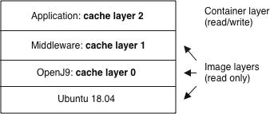

<!--
* Copyright (c) 2017, 2026 IBM Corp. and others
*
* This program and the accompanying materials are made
* available under the terms of the Eclipse Public License 2.0
* which accompanies this distribution and is available at
* https://www.eclipse.org/legal/epl-2.0/ or the Apache
* License, Version 2.0 which accompanies this distribution and
* is available at https://www.apache.org/licenses/LICENSE-2.0.
*
* This Source Code may also be made available under the
* following Secondary Licenses when the conditions for such
* availability set forth in the Eclipse Public License, v. 2.0
* are satisfied: GNU General Public License, version 2 with
* the GNU Classpath Exception [1] and GNU General Public
* License, version 2 with the OpenJDK Assembly Exception [2].
*
* [1] https://www.gnu.org/software/classpath/license.html
* [2] https://openjdk.org/legal/assembly-exception.html
*
* SPDX-License-Identifier: EPL-2.0 OR Apache-2.0 OR GPL-2.0-only WITH Classpath-exception-2.0 OR GPL-2.0-only WITH OpenJDK-assembly-exception-1.0
-->

# Introduction to class data sharing

Sharing class data between Eclipse OpenJ9&trade; VMs improves start up performance and reduces memory footprint. Consider the following outcomes for two VMs that are running similar Java applications but sharing class data:

- Start up performance is improved by placing classes that each application needs when initializing into a shared classes cache. The next time the application runs, it takes less time to start because the classes are already available.

- Memory footprint is reduced by sharing common classes between the applications.

When class data sharing is enabled, OpenJ9 automatically creates shared memory that stores and shares the classes in memory between processes. This shared classes cache is updated dynamically; when an application loads new classes, the VM automatically stores them in the cache without any user intervention. By default, class data sharing is enabled for bootstrap classes, as described in [Enabling class data sharing](#enabling-class-data-sharing).

When class data sharing is enabled, Ahead-of-time (AOT) compilation is also enabled by default, which dynamically compiles certain methods into AOT code at runtime. By using these features in combination, startup performance is further improved because the cached AOT code can be used to quickly enable native code performance for subsequent runs of your application. For more information about AOT, see [AOT Compiler](aot.md). Further performance improvements are gained by storing JIT data and profiles in the shared classes cache.

The contents of a shared classes cache can include the following artifacts:

- Bootstrap classes
- Application classes
- Metadata that describes the classes
- AOT-compiled code
- JIT data
- GC hints (for initial Java heap size)
-  Bootstrap `jar` file indexes

## Cache utilities

Active caches can be managed by a set of cache utilities, which are invoked by specifying `-Xshareclasses` suboptions. These utilities control the following types of operations:

- Displaying information about the caches on a system.
- Adjusting the size of a cache and the amount of space that is reserved for AOT code or JIT data.
- Creating a snapshot of a non-persistent cache to save to disk and restoring the cache from disk.
- Troubleshooting cache problems.
- Removing unwanted caches on a system.

These cache utilities are discussed in more detail in the sections that follow.

## Enabling class data sharing

Class data sharing is enabled by default for bootstrap classes, unless your application is running in a container.
Default behavior includes the following characteristics:

- On Windows&reg;, the cache is created in the user's `C:\Users\<username>\AppData\Local\javasharedresources` directory. On z/OS&reg;, the default cache directory is `/tmp/javasharedresources`. On other systems, the cache is created in the `.cache/javasharedresources` directory in the user's home directory, unless the `groupAccess` parameter is specified, in which case it is created in `/tmp/javasharedresources`. Do not set the home directory on an NFS mount or shared mount across systems or LPARs.
- The cache name is `sharedcc_%u`, where `%u` is the current user name.
- If class data sharing fails, the VM still starts without printing any errors.

Shared class behavior is controlled by specifying the [-Xshareclasses](xshareclasses.md) option on the command line when you start your application. The default settings are equivalent to specifying the following suboptions:

```
-Xshareclasses:bootClassesOnly,nonFatal,silent
```

You can enable class data sharing for non-bootstrap classes as well as bootstrap classes, by omitting the `bootClassesOnly` suboption. You can also disable all class data sharing by using the `none` suboption.

Further suboptions are available to configure a cache at startup, including name, location, and startup size. You can also use cache utilities to manage a shared classes cache after it is initialized and in use.

A shared classes cache can be *persistent* or *non-persistent* according to the following definition:

- persistent caches are written to memory-mapped files and remain in place, even after a system is rebooted.
- non-persistent caches exist in shared memory and are automatically removed when the operating system is restarted.

By default, a shared classes cache is persistent, except on the z/OS platform. Support for persistent shared class cache was added on z/OS in [0.40.0 release](version0.40.md#support-for-persistent-shared-classes-cache-added-on-zos) but the default cache type on z/OS is still nonpersistent.

If you are using a non-persistent cache, you can use a cache utility to create a snapshot of the cache, which can be reinitialized after a reboot. For more information, see [Saving a non-persistent shared classes cache](#saving-a-non-persistent-shared-classes-cache).

If you have multiple VMs and you do not change the default shared classes behavior, the VMs share a single default cache, assuming that the VMs are from a single Java installation. If the VMs are from different Java installations, the cache might be deleted and re-created.

For a set of best practices when using class data sharing, see [Creating a shared classes cache](#creating-a-shared-classes-cache).


## Class data sharing operations

When a VM loads a class and the class loader is enabled for class sharing, the VM looks in the shared classes cache to see if the class is already present. If the class is present and the classpath or URL to load the class is a match, the VM loads the class from the cache. Otherwise, it loads the class from the file system and writes it into the cache.

The VM detects file system updates by storing timestamp values into the cache and comparing the cached values with actual values. In this way, the VM detects when a class might be invalidated and can mark the class as *stale*. These operations happen transparently when classes are loaded, so users can modify and update as many classes as they like during the lifetime of a shared classes cache, knowing that the correct classes are always loaded. Stale classes are *redeemed* if the same class is subsequently fetched by the class loader from another VM and checked against the stale class in the cache.

Occasionally, caches that are created from one version of the VM might not be compatible with caches that are created from a different version. This situation typically occurs when an update is made in OpenJ9 that changes the internal cache data structure. If a VM detects an incompatible cache at start up, it creates a new cache that can coexist, even if it has the same name. The VM detects a conflict by checking an internal shared classes cache generation number.

Caches are not compatible between VMs that are using different object storage modes. For example, a 64-bit VM that uses compressed references to store 64-bit objects in a 32-bit representation, cannot share a cache with a 64-bit VM that is not using compressed references. For more information about object storage options, see [Compressed references](allocation.md#compressed-references).

In the OpenJ9 implementation of `java.net.URLClassLoader`, classes are read from and written to the cache by using the public Helper API. Therefore, any class loader that extends `java.net.URLClassLoader` gets class sharing support for free provided that it continues to use the methods in `java.net.URLClassLoader` to load classes. Custom class loaders that do not extend `java.net.URLClassLoader` must be adapted to share class data as described in [Support for custom class loaders](#support-for-custom-class-loaders).

In the 0.46.0 release, the [`-XX:+ShareOrphans`](xxshareorphans.md) option was introduced that automatically enables the `-Xshareclasses` option. You can enable class sharing from all class loaders, irrespective of whether the class loader implements the shared classes cache API. For classes from custom class loaders that did not implement the shared classes cache APIs, they are shared as orphans. From the 0.47.0 release onwards, if the `-Xshareclasses` option is specified in the command line, it automatically enables the `-XX:+ShareOrphans` option. Now you need not explicity specify the `-XX:+ShareOrphans` option.

### AOT code and JIT data

OpenJ9 can automatically store small amounts of AOT code and JIT data, which helps improve performance in the following ways:

- The JIT compiler dynamically compiles certain methods into AOT code at runtime. Subsequent VMs that attach to the cache can take advantage of the compiled code to start faster.
- The JIT compiler stores profiling data and various compilation *hints* into the shared classes cache. This data enables subsequent VMs that attach to the cache to start faster, run faster, or both.

The default settings provide significant performance benefits. However, you can specify options on the command line to configure AOT code storage or JIT data storage in the shared classes cache, as shown in the following table:

| Component | Setting a minimum storage value          | Setting a maximum storage value  | Turning off storage       |
|-----------|------------------------------------------|----------------------------------|---------------------------|
| AOT code  |[`-Xscminaot<size>`](xscminaot.md)        |[`-Xscmaxaot<size>`](xscminaot.md)|[`-Xshareclasses:noaot`](xshareclasses.md#noaot)|
| JIT data  |[`-Xscminjitdata<size>`](xscminjitdata.md)|[`-Xscmaxjitdata<size>`](xscminjitdata.md)|[`-Xshareclasses:nojitdata`](xshareclasses.md#nojitdata)|

The following cache utilities are available to adjust the storage values when a cache is active:

| Component | Adjusting the minimum storage value                           | Adjusting the maximum storage value         |
|-----------|---------------------------------------------------------------|---------------------------------------------|
| AOT code  |[`-Xshareclasses:adjustminaot`](xshareclasses.md#adjustminaot) | [`-Xshareclasses:adjustmaxaot`](xshareclasses.md#adjustmaxaot) |
| JIT code  |[`-Xshareclasses:adjustminjit`](xshareclasses.md#adjustminjit) | [`-Xshareclasses:adjustmaxjit`](xshareclasses.md#adjustmaxjit) |

You can also use the `-Xshareclasses:findAotMethods` cache utility to list the AOT methods in a cache that match a method specification. This utility helps you identify methods that are causing a failure in an application. You can then invalidate the method without destroying the cache by using the `-Xshareclasses:invalidateAotMethods` cache utility. You can also revalidate an AOT method with the `-Xshareclasses:revalidateAotMethods` cache utility. To troubleshoot AOT problems, use the `-Xshareclasses:verboseAOT` suboption on the command line, which generates output about AOT code that is found or stored in the cache. For more information, see [`-Xshareclasses`](xshareclasses.md).

## Creating a shared classes cache

The [-Xshareclasses](xshareclasses.md) option is highly configurable, allowing you to specify where to create the cache, how much space to allocate, and more. The following best practices apply to using class data sharing:

- Before starting your application, use the [`-Xshareclasses:listAllCaches`](xshareclasses.md#listallcaches) cache utility to review and maintain the existing caches on your system.

    This option lists all the caches that exist in the default directory, including compatible and incompatible caches. You can also specify the `cacheDir` suboption to look for caches in a specified directory. Remove any obsolete caches, as described in [Housekeeping](#housekeeping).

- If you are creating a new cache, set an application-specific cache name ([`-Xshareclasses:name=<name>`](xshareclasses.md#name)).

    If a cache with the specified name doesn't already exist, a new cache is created.

    This avoids sharing your application cache with a cache that is enabled by default or with another application that doesn't set a name, and ensures that the size of your application cache can be set appropriately and that cache space is used exclusively for your application.

    :fontawesome-solid-pencil:{: .note aria-hidden="true"} **Note:** You cannot change the size of a default cache that already exists by using the [`-Xscmx`](xscmx.md) option, as that option has no effect on a pre-existing cache.

- Set a specific cache directory ([`-Xshareclasses:cacheDir=<directory>`](xshareclasses.md#cachedir)).

    Set a cache directory that is specific to your application, to  avoid sharing the default cache directory with the default cache, or other application caches that don't set a cache directory. Your application will be unaffected by a user running [`java -Xshareclasses:destroyAll`](xshareclasses.md#destroyall-cache-utility). Do not set the cache directory on an NFS mount or a shared mount across systems or LPARs.

    In addition, if you have VMs from different Java installations, of the same Java release and installed by the same user, each VM checks whether the existing default shared cache in the cache directory is from the same Java installation as the VM. If not, the VM deletes that shared cache, then creates a new one. Specifying a different cache directory for each Java installation avoids this situation.

- Ensure that the cache directory permissions are set appropriately ([`-Xshareclasses:cacheDirPerm`](xshareclasses.md#cachedirperm)).

    It is good practice to explicitly set permissions for the cache directory when the defaults are not appropriate. Access is controlled by operating system permissions and Java security permissions; read/write access is the default only for the current user. On Unix systems, you can use the [`-Xshareclasses:groupAccess`](xshareclasses.md#groupaccess) suboption to allow read/write permissions for groups as well as users.

    On z/OS, a cache can be accessed only by a VM that is running in the same storage key as the VM that created the cache. If the keys do not match, permission to access the cache is denied.

- Set the [`-Xshareclasses:nonfatal`](xshareclasses.md#nonfatal) option.

    In most cases, setting this option allows your application to start even if there is a problem opening or creating the shared cache. The VM will continue to start *without* class data sharing.

- Set a soft maximum size for the cache by specifying the [-Xscmx](xscmx.md) option with the [`-XX:SharedCacheHardLimit`](xxsharedcachehardlimit.md) option.

    For example, you might create a 64 MB shared cache and set a smaller value, such as 16 MB, for the `-Xscmx` option, to limit the data stored in the cache (`-XX:SharedCacheHardLimit=64m -Xscmx16m`). You can then adjust the soft maximum size by using the [`-Xshareclasses:adjustsoftmx`](xshareclasses.md#adjustsoftmx) cache utility or the `MemoryMXBean.setSharedClassCacheSoftmxBytes()` method in the `com.ibm.lang.management` API. For more information, see [Setting a soft maximum size](xscmx.md#setting-a-soft-maximum-size).


### Creating layer caches

Creating a layered cache might be useful when you are building a Docker image.

Normally, writing to an existing shared cache in a lower image layer results in Docker duplicating the shared cache to the top layer (following the Docker [copy-on-write strategy](https://docs.docker.com/storage/storagedriver/#the-copy-on-write-cow-strategy)). With a layered cache, you can instead write into a new cache in the top layer. The new cache builds on the existing cache, so space is saved in the image.

The following example shows a Docker container with four layers:

: 


1. The lowest layer is a Ubuntu Docker image.
2. The next layer is an OpenJ9 Docker image that is built on the Ubuntu image. As part of this image, the `-Xshareclasses:name=MyCache` suboption is used to create a cache called `MyCache`. The layer number assigned to this cache is `0`. The `listAllCaches` suboption shows the cache and the layer number:


        java -Xshareclasses:listAllCaches
        ...
        Cache name              level         cache-type      feature         layer       OS shmid       OS semid       last detach time

        Compatible shared caches
        MyCache                 Java8 64-bit  persistent      cr              0                                         Mon Sep 23 11:41:04 2019


3. The next Docker layer up is a middleware image that is built on the OpenJ9 image. As part of this image, the `-Xshareclasses:name=MyCache,layer=1` suboption is used to create another cache called `MyCache`. Because the `layer=1` suboption is specified, this new cache is a layered cache, which builds on `MyCache` in the previous container layer. (Open Liberty starts two VMs, so if you instead use the `createLayer` suboption here, two layered caches are created, with layer numbers of 1 and 2.) Note that cache layers are different from, and independent of, container layers.

4. In the same way, another Docker layer is added for an application, and another layered cache is created to add to `MyCache`. The `listAllCaches` suboption now shows all the caches and their layers:


        java -Xshareclasses:listAllCaches
        ...
        Cache name              level         cache-type      feature         layer       OS shmid       OS semid       last detach time

        Compatible shared caches
        MyCache                 Java8 64-bit  persistent      cr              0                                         Mon Sep 23 11:41:04 2019
        MyCache                 Java8 64-bit  persistent      cr              1                                         Mon Sep 23 11:46:25 2019
        MyCache                 Java8 64-bit  persistent      cr              2                                         In use


The caches are created in the same directory.

When you use the `-Xshareclasses:name=MyCache` suboption in future Java commands, all the caches are started. The top-layer cache is started in read/write mode, and lower-layer caches are started in read-only mode. Modifying a lower-layer cache will invalidate all the caches in the layers above.

The following options and cache utilities are available for creating, managing, and removing layered caches:

- [`-Xshareclasses:createLayer`](xshareclasses.md#createlayer)
- [`-Xshareclasses:layer`](xshareclasses.md#layer)
- [`-Xshareclasses:printTopLayerStats`](xshareclasses.md#printtoplayerstats) (for example output, see [printTopLayerStats](shrc_diag_util.md#printtoplayerstats))
- [`-Xshareclasses:destroyAllLayers`](xshareclasses.md#destroyalllayers)

## Saving a non-persistent shared classes cache

As described in an earlier section, a shared classes cache can be persistent or non-persistent; persistent caches are memory-mapped files. By default, a cache is persistent on all platforms, except z/OS. Non-persistent caches are stored in shared memory and are removed when a system is rebooted. If you want to save a non-persistent cache beyond a reboot, you might want to consider taking a cache snapshot.

To create a snapshot of a non-persistent shared classes cache, use the [`-Xshareclasses:snapshotCache`](xshareclasses.md#snapshotcache) cache utility. The snapshot has the same name and location as the shared cache, as specified by the `name` and `cacheDir` suboptions. The shared cache can be in use when the snapshot is taken, but VMs are blocked when they try to write to the shared cache while the cache data is copied to the file.

Typically, after a system is reinitialized, the snapshot file is used to restore the copy of the non-persistent cache into shared memory, by using the [`-Xshareclasses:restoreFromSnapshot`](xshareclasses.md#restorefromsnapshot) cache utility. Because this process removes all non-persistent caches from shared memory, restoring the cache from the snapshot file can result in better VM startup performance, because the contents of the shared cache, including classes and AOT code, do not have to be re-created.

The [`-Xshareclasses:listAllCaches`](xshareclasses.md#listallcaches) cache utility can be used to identify snapshots on a system.

A snapshot can be created only if the user has sufficient permissions to create the destination snapshot file. If a snapshot of the same name exists already, it is overwritten. On platforms that support persistent caches, the `nonpersistent` suboption must be specified in order to create a snapshot. For information about removing snapshot files, see the `destroySnapshot` and `destroyAllSnapshots` cache utilities in [Housekeeping](#housekeeping).

:fontawesome-solid-pencil:{: .note aria-hidden="true"} **Note:** The `snapshotCache` and `restoreFromCache` cache utilities cannot be used on Windows systems.

## Housekeeping

Caches can be deleted if they contain many stale classes or if the cache is full and you want to create a bigger cache. Use one of the following utilities to remove unwanted caches:

- [`-Xshareclasses:destroy`](xshareclasses.md#destroy): Removes specific caches when used with the `name`, `cacheDir`, and `nonpersistent` suboptions.
- [`-Xshareclasses:destroyAll`](xshareclasses.md#destroyall): Removes all the caches that are specified by the `cacheDir` and `nonpersistent` suboptions.
- [`-Xshareclasses:destroySnapshot`](xshareclasses.md#destroysnapshot): Removes a cache snapshot from disk that is specified by `name` and `cacheDir` suboptions.
- [`-Xshareclasses:destroyAllSnapshots`](xshareclasses.md#destroyallsnapshots): Removes all cache snapshots from disk that are found by specifying the `cacheDir` suboption.
- [`-Xshareclasses:destroyAllLayers`](xshareclasses.md#destroyalllayers): Removes all shared cache layers that are specified by the `name` and `cacheDir` suboptions.

:fontawesome-solid-pencil:{: .note aria-hidden="true"} **Note:** You must always use the utilities to remove non-persistent caches correctly from shared memory.

Caches can also be removed if they are unused for a specified amount of time. To configure time-based housekeeping, use the [-Xshareclasses:expire](xshareclasses.md#expire) option.

If you want to remove a cache but allow it to be re-created when the VM restarts, use the [`-Xshareclasses:reset`](xshareclasses.md#reset) option.


## Support for custom class loaders

Classes are shared by the bootstrap class loader internally in the VM. The OpenJ9 implementation of `java.net.URLClassLoader` is modified to use `SharedClassURLClasspathHelper` and any class loaders that extend `java.net.URLClassLoader` can inherit this behavior. If you are using a custom class loader that does not extend `java.net.URLClassLoader`, you can use the Java Helper API to find and store classes in a shared classes cache.

For classes from custom class loaders that did not implement the shared classes cache APIs and if the [`-XX:+ShareOrphans`](xxshareorphans.md) option is enabled, those classes will be shared as orphans. For more information, see [Class data sharing operations](#class-data-sharing-operations).

If a running application uses its own class loader and you are using a `SecurityManager`, you must grant the class loader permission to `SharedCachePermission` before they can share classes. To grant permission, add shared class permissions to the `java.policy` file by specifying the `ClassLoader` class name. Permissions can be set for `read`, `write`, or `read,write`. For example:

```
permission com.ibm.oti.shared.SharedClassPermission
        "com.abc.customclassloaders.*", "read,write";
```

If a running application is calling the `com.ibm.oti.shared.SharedClassUtilities` APIs `getSharedCacheInfo()` or `destroySharedCache()`, you must also grant the code calling these APIs the appropriate `SharedClassesNamedPermission`. For example:

```
permission com.ibm.oti.shared.SharedClassesNamedPermission "getSharedCacheInfo";
permission com.ibm.oti.shared.SharedClassesNamedPermission "destroySharedCache";
```

### The Java shared classes Helper API

The Java Helper API classes can be found in the [`com.ibm.oti.shared`](api-overview.md#monitoring-and-management) package.

Each class loader that wants to share classes must get a `SharedClassHelper` object from a `SharedClassHelperFactory`. The `SharedClassHelper`, when created, has a one to one relationship with the class loader. That is, it belongs to the class loader that requested it and can only store classes defined by that class loader. The `SharedClassHelper` gives the class loader a simple API for finding and storing classes in the class cache to which the VM is connected. If the class loader is garbage collected, its `SharedClassHelper` is also garbage collected.

The following main functions are available from the `SharedClassHelper` API:

- `findSharedClass`: Used to check whether a class is already in the cache before looking for the class on the file system.
- `storeSharedClass`: Used to store a class in the cache.
- `setSharingFilter`: A filter that can be used to decide which classes are found and stored in the cache. This filter can be applied to a particular package by implementing the `SharedClassFilter` interface. To apply a filter to all non-bootstrap class loaders that share classes, specify the [`-Dcom.ibm.oti.shared.SharedClassGlobalFilterClass`](dcomibmotisharedsharedclassglobalfilterclass.md) system property on the command line.

You can also define partitions in a cache to store sets of classes separately from one another. For more information, see [`SharedClassHelper` cache partitions](#sharedclasshelper-cache-partitions).

Each class loader that wants to share data must get a `SharedDataHelper` object from a `SharedDataHelperFactory`.
A `SharedDataHelperFactory` provides an interface that can be used to create `SharedDataHelpers`, which are used for storing Java byte array data. A `SharedDataHelper` also has a one to one relationship with a class loader, although a class loader can exist without a `SharedDataHelper`.


### The Java shared classes utility API

The following APIs are available for obtaining information about a shared classes cache:

- `com.ibm.oti.shared.SharedClassStatistics`: Obtains information about cache size, including free space, soft maximum limit, and the limits enforced for AOT and JIT data.
- `com.ibm.oti.shared.SharedClassUtilities`: Obtains detailed information about a shared classes cache, including its size, name, type, and status.
- `com.ibm.oti.shared.SharedClassCacheInfo`: Stores information about a shared classes cache and provides API methods to retrieve the information and remove caches. You can also use the `IterateSharedCaches` and `DestroySharedCache` [JVMTI extensions](interface_jvmti.md#iteratesharedcaches).

## Support for bytecode instrumentation

Modifying the bytecode of a set of classes at runtime is a useful mechanism for adding functions to a program, such as profiling or debugging. The JVM Tools Interface (JVMTI) includes hooks that allow you to instrument the byte code in this way. Alternatively, you can write your own Java agent that uses the `java.lang.instrument` API. Sharing classes that are changed before they are loaded adds complexity to the class sharing process.

By default, if OpenJ9 detects that a JVMTI agent or `java.lang.instrument` agent has registered to modify class bytes, modified classes are not stored in the cache. Instead, the VM stores original class byte data in the cache, which allows classes to be retransformed.

If you turn off bytecode instrumentation support by specifying [`-Xshareclasses:disableBCI`](xshareclasses.md#disablebci) and do not use a *modification context* to share modified classes safely, all bytecode is loaded from the file system for the agent to modify. When passed to the cache for storing, the VM compares the bytes with known classes of the same name. If a match is found, the class is reused. However, if a match is not found, the potentially modified class is stored in the cache in a way that prevents other VMs from loading it. In this situation, performance can be affected because the bytecode is always loaded from the file system and compared with existing classes in the cache. When bytecode instrumentation is turned off, classes loaded from the shared cache cannot be retransformed.
For more information about using a modification context, see [Sharing modified bytecode](#sharing-modified-bytecode).


### Redefined and retransformed classes

The following rules exist for classes that are redefined or retransformed by JVMTI or `java.lang.instrument` agents:

- Redefined classes contain replacement bytecode that is provided by an agent at run time by using the JVMTI `RedefineClasses` or `Instrumentation.redefineClasses` function. A typical use case is for debugging, where function is added for log output. These classes are never stored in the cache.

- Retransformed classes contain bytecode that can be changed without any reference to the original bytecode by using the JVMTI `RetransformClasses` or `Instrumentation.retransformClasses` functions. A typical use case is a profiling agent that adds or removes profiling calls with each retransformation. These classes can be modified multiple times and are not stored in the cache by default. If you want to store these modified classes for reuse, you can do so by setting the [`-Xshareclasses:cacheRetransformed`](xshareclasses.md#cacheretransformed) suboption when you start your application. This option turns off bytecode instrumentation support, forcing cache creation into [`-Xshareclasses:disableBCI`](xshareclasses.md#disablebci) mode.

### Sharing modified bytecode

Sharing modified bytecode can be advantageous for applications that use the same modifications because the transformation process needs to happen only once. OpenJ9 allows multiple VMs that are using the same or different types of class modifications to safely share the cache. However, when a class is modified and cached, it cannot be modified (retransformed) further.

Modified bytecode can be shared safely by using a *modification context*. Use the [`-Xshareclasses:disableBCI`](xshareclasses.md#disablebci) and [`-Xshareclasses:modified=<modified_context>`](xshareclasses.md#modified) suboptions when you start your application, where `<modified_context>` is a user-defined description. The cache is structured so that any VM that is started with the same modification context can share the classes in a private area. The following outcomes apply to VMs that do not want to share the modified classes:

- A VM that is started without specifying a modification context shares classes outside of that area as normal.
- A VM that is started with a different modification context, shares classes in its own private area.

#### `SharedClassHelper` cache partitions

Another method of structuring and protecting classes in the shared classes cache can be implemented by using the `SharedClassHelper` API with a custom class loader. This mechanism creates partitions by using a string key to identify a set of classes, which can be stored and retrieved by the class loader. A use case for this mechanism is Aspect Oriented Programming (AOP) where aspects are woven in to bytecode when a class is loaded into the VM. Being able to partition the cache provides a suitable level of granularity when you want to use different aspect paths.

Although it is possible to combine partitions and modification contexts, this practice is not recommended because the cache will contain partitions within partitions.

:fontawesome-solid-pencil:{: .note aria-hidden="true"} **Note:** Partitions are not supported by the bootstrap class loader or the default application class loader.


## See also

- [AOT compiler](aot.md)
- [Class sharing article](https://developer.ibm.com/languages/java/tutorials/j-class-sharing-openj9/)
- [Diagnosing problems with class data sharing](shrc_diag_util.md)


<!-- ==== END OF TOPIC ==== shrc.md ==== -->
